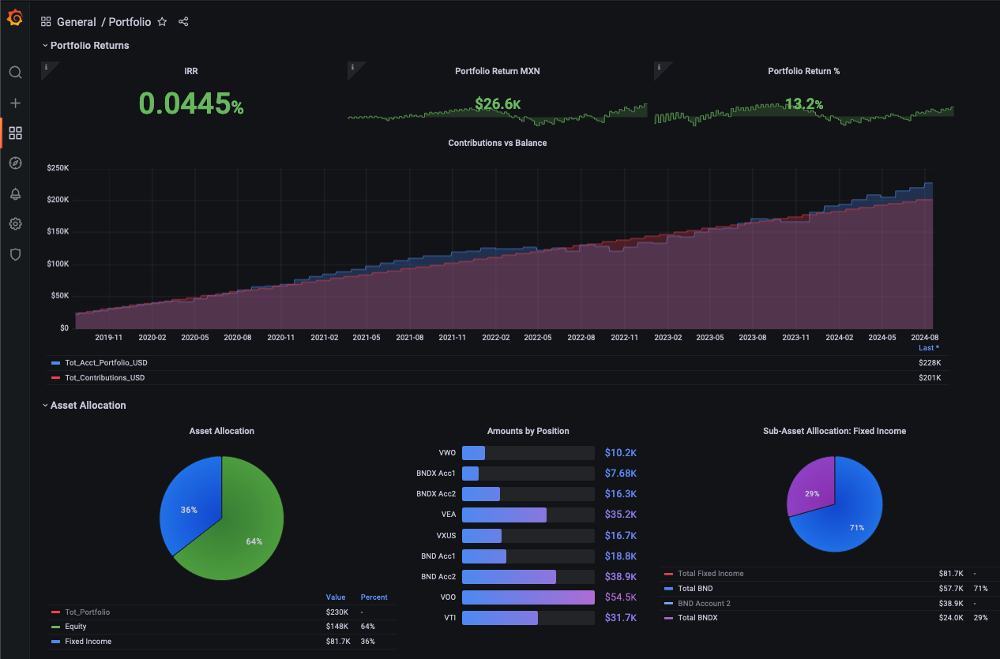
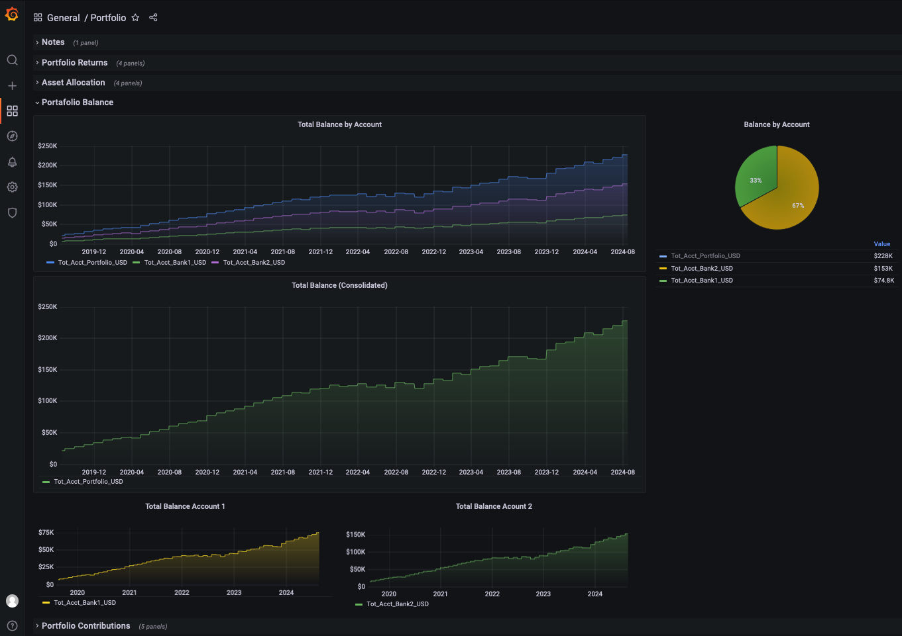

# Investment Portfolio Visualizer

**ToDo: Create GIF example here.**

## What it does

The program creates a custom portfolio visualizer to help you analyze an investment portfolio.

Its main features are:

- You can consolidate several bank accounts into one portfolio.

- You can have several portfolios for different users.

- You can customize all of the dashboards.

- You can aggregate the data in a way that makes sense to you.

- Graphs are dynamic so you can analyze different time periods.

## How to Install

To use the portfolio visualizer you will need to previously install:

- [Python 3](https://www.python.org/downloads/)
- [Docker](https://www.docker.com/)

I would recommend using a virtual environment.
You can find documentation on setting one up [here.](https://docs.python.org/3/library/venv.html)

Once python 3 is installed, you will need to add the following libraries from pip:

- [Pandas](https://pypi.org/project/pandas/)
- [Cryptography](https://pypi.org/project/cryptography/)
- [yfinance](https://pypi.org/project/yfinance/)
- [Pyxirr](https://pypi.org/project/pyxirr/)
- [SQLAlchemy](https://pypi.org/project/SQLAlchemy/)
- [mysql-connector](https://pypi.org/project/mysql-connector-python/)

All the docker images will automatically be downloaded from Docker Hub when you run the docker-compose.yml file.

The images that docker uses are:

- [MySQL](https://hub.docker.com/_/mysql)
- [Grafana](https://hub.docker.com/r/grafana/grafana)

The customized portfolio image that will be downloaded will be:

- [https://hub.docker.com/r/portfedh/portfolio_dashboard/](https://hub.docker.com/r/portfedh/portfolio_dashboard/tags)

This is the docker image that has the demo user portfolio.

Its meant as a starting point for you to create your own customized dashboards.



## How to Use

To give the script a try, follow the instructions in the 'First time setup' section.

If you decide want to use it for your portfolio, then follow the instructions in the other sections to customize the scripts and add your data.

## First time setup

- Make sure you have installed python & docker with all their dependencies.

- Make sure docker is up and running.

- Open the following file in your code editor:

```bash
01_portfolio_run.sh
```

- Modify the 'VENV' variable and add the path to your python virtual environment.

- Now delete the line with the following text:

Thats it!

You are ready to run the script for the first time.

## First time run

- Navigate to your project folder.

- Make sure your virtual environment is activated.

- Execute the following bash script from your terminal:

```bash
./1_portfolio_run.sh
```

The script will ask how long to wait for MySQL Volume to set up.

- Since this is the first time, select 40 seconds.

- On future runs select 1 second.

When asked to enter a username use:

> admin

For the password use:

> newpassword

Wait for all scripts to execute.

Open you browser and go to the Grafana dashboard at [localhost:3000/](localhost:3000/)

Browse through the Portfolio Dashboard. You should see something like this:



When you are ready to close everything up, head back to the terminal and execute the closing bash script:

```bash
./2_portfolio_close.sh
```

Thats it!

## Adding your own data Inputs

To create your own dashboards, you must first create the input files that the scripts will use.

- Navigate to the 'inputs' directory.

- Create a new directory.

- Name your directory with the username you want for that portfolio.

- You will need to add 3 files for every investment account you add.

  - contributions_username_account.csv
  - monthly_account_balance_username_account.csv
  - trade_history_username_account.csv.

Take a look at the input files for the demo user 'user1' as examples to fill in your own.

Here is a brief description of the information you should add in every file:

Contributions file: The CSV file should have the date and amount of every deposit or withdrawal you've made to that account. Deposits to the account should be positive numbers (+) and withdrawals from the account should be negative (-) numbers.

Account balance file: The CSV file should have a date value with the last day of each month and the total balance of the bank statement for that month. If you add more than one bank account, the date range in both files must match, even if the balance is $0 for one of the accounts.

Trade history file: The CSV file should have the date, the company ticker, and each trade you´ve made in that account (buy or sell, not dividends). Buying shares should be written as positive numbers (+) and selling shares as negative (-) numbers.

## Adding your scripts

Once the input files are set up, you must now modify the scripts that make the calculations that to create the dashboard.

- Navigate to the usr/ directory.

- Create a new directory with the same username you chose for the input files.

- Copy all the files from the demo user, located in usr/user1 into the new folder you just created.

- Modify each file so it uses your contributions, account balance and trade history files.

All scripts have comments explaining how they work.

If you need more help, go to the /system_design_charts directory.
You will find a more detailed explanation of how the scripts work there.

If you still get stuck, post an issue and I'll be happy to help.

## Protecting your data

All your data is in the CSV files located in the Input and Output directory.

Grafana is only a visualizer and does not store any data.

MySQL container only keeps the data while the session exists, so its erased every time the container is deleted.

Make sure to execute the "2_portfolio_close.sh" file when you are done to delete the docker containers and the outputs folder content.

If you use GitHub or GitLab, make sure your inputs folder is in the .gitignore file.

## Making all your scripts run automatically

To run all your scripts with a single command you will use the following:

```bash
./1_portfolio_run.sh
```

To be able to use the bash script, you must first make a few changes so it will find the files for the user your just created:

```bash
  DOCKER_IMAGE="portfedh/portfolio_dashboard:user1_grafana_2024_08"  # Leave this por now, you will update this later.
  DOCKER_COMPOSE="./usr/user1/docker-compose.yml"  # Update <user1>  to the username you selected.
  FILE_PATH="usr/user1/" # Update <user1>  to the username you selected.
  echo
```

Once you have added your user files. Execute the code and it should run all your files and set up Grafana.

## Customizing your Grafana dashboard

Grafana is an open source data visualizer that will connect to MySQL and read the data.

The dashboard was configured to display data of the demo user, so you must change it to read your new users data.

To do it:

- Open Grafana

- Select a dashboard

- Select any panel

- Click 'Edit'

- Click on 'Data Source' and select MySQL

- Use the Query editor to select the right table and column for every variable.

- Do this for all your variables.

- Save the dashboard.

To make sure that your changes persist the next time you run Docker do the following:

- Open your terminal

- Find your container id using:

```bash
docker ps
```

- Save your changes using:

```bash
docker commit <hash> <name>:<version>
```

- Go to Docker hub and create an account.

- Create a repository

- Rename your image to match your Docker hub repo:

```bash
docker tag local-image:tagname new-repo:tagname
```

- Now you can push your changes to Docker hub:

```bash
docker push <repo:tagname>
# Example
docker push portfedh/portfolio_dashboard:grafana
```

- Every time you make a change to your dashboard, use docker commit to save changes.

- Push to Docker hub image to make sure it persists when you close the container.

Finally, open the file 1_portfolio_run.sh in your editor.

- Update the variable name to your repo name and tag name from Docker Hub.

```bash
  DOCKER_IMAGE="portfedh/portfolio_dashboard:user1_grafana"  # Update this line.
```

You are done!

Your portfolio is fully setup.

You can run it whenever you like, and close it down just as easily.

```bash
# Run
./1_portfolio_run.sh
# Close
./2_portfolio_close.sh
```

## Updating you dashboard

Setting up each user takes a bit of time, but updating the dashboard is very simple and fast.

Every month update your contributions, balance and trading input files, then run your scripts as usual.

You should be able to do it in a few minutes and your portfolio will reflect the changes immediately.

## Conclusion

I made this project to automate a tedious recurring task.

If you have any ideas as to how to make this project better, please feel free to reach out.

Good luck!
